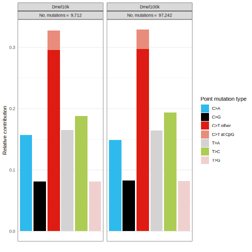

```r
library(BSgenome)
# if (!require("BiocManager", quietly = TRUE))
#   install.packages("BiocManager")
# 
# BiocManager::install("BSgenome.Dmelanogaster.UCSC.dm6")
library("BSgenome.Dmelanogaster.UCSC.dm6")
library(MutationalPatterns)
library(reshape2)

setwd("Documents/Teaching/SMTB2023/20230810_rotation/")
```

```
## Error in setwd("Documents/Teaching/SMTB2023/20230810_rotation/"): cannot change working directory
```

```r
sample_names <- c("Dmel10k","Dmel100k")
vcf_files <- c("ZI_allchrom_clean_bi_correctANN.ann.pick.10000.vcf",
               "ZI_allchrom_clean_bi_correctANN.ann.pick.100000.vcf")
###genome
ref_genome<-"BSgenome.Dmelanogaster.UCSC.dm6"

######work with data
vcfs <- read_vcfs_as_granges(vcf_files, sample_names, genome = ref_genome,
                             remove_duplicate_variants = F,
                             predefined_dbs_mbs = T)
summary(vcfs)
```

```
## [1] "GRangesList object of length 2 with 0 metadata columns"
```

```r
###########DO plots
type_occurrences <- mut_type_occurrences(vcfs, ref_genome)
plot_spectrum(type_occurrences,by=rownames(type_occurrences),legend = TRUE)
```

```
## Warning: No error bars can be plotted, because there is only one sample per mutation spectrum.
##               Use the argument: `error_bars = 'none'`, if you want to avoid this warning.
```


```r
plot_spectrum(type_occurrences,by=rownames(type_occurrences),legend = TRUE, CT=T)
```

```
## Warning: No error bars can be plotted, because there is only one sample per mutation spectrum.
##               Use the argument: `error_bars = 'none'`, if you want to avoid this warning.
```



```r
mut_mat <- mut_matrix(vcfs, ref_genome)
plot_96_profile(mut_mat)
```


